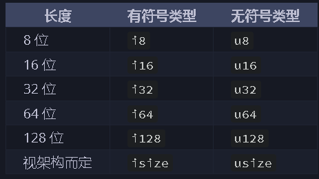
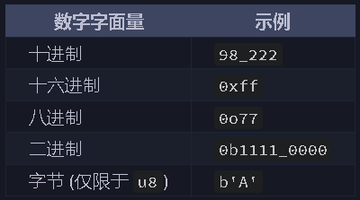

# 变量
- 所有对于变量的初始化操作都理解为绑定而非赋值，因为默认情况下定义的变量是不可变的。
- 对于不用而又定义了的变量可以在变量前加`_`，否则会有warning。
    ```rust
    fn main {
        let a = 4;
        let _b = 6;
    }
    ```
    > warning 如下
    ```
    warning: unused variable: `a`
    --> src/main.rs:2:9
    |
    2 |     let a = 4;
    |         ^ help: if this is intentional, prefix it with an underscore: `_a`
    |
    = note: `#[warn(unused_variables)]` on by default

    warning: `demo` (bin "demo") generated 1 warning
    ```
- 变量shadowing：
    ```rust
    fn main() {
        let a = 5;
        let a = 6;
        println!("{}", a)
    }

    ```
    > cargo run 如下
    ```
    warning: unused variable: `a`
    --> src/main.rs:2:9
    |
    2 |     let a = 5;
    |         ^ help: if this is intentional, prefix it with an underscore: `_a`
    |
    = note: `#[warn(unused_variables)]` on by default

    warning: `demo` (bin "demo") generated 1 warning
        Finished `dev` profile [unoptimized + debuginfo] target(s) in 0.97s
        Running `target/debug/demo`
    6
    ```
# 数值类型
- 默认整数i32，默认浮点类型是 f64，usize与isize是机器多少位它就多少位。

     
    
    - 整数溢出处理：当溢出时在debug模式下编译运行的rust会进行检查，如果溢出则panic，但是在release下则不会报错了。溢出大的处理就是采取循环进位，比如在 u8 的情况下，256 变成 0，257 变成 1。
    - 显式处理可能的溢出，可以使用标准库针对原始数字类型提供的这些方法：
        - 使用 `wrapping_*` 方法在所有模式下都按照补码循环溢出规则处理
        - 如果使用 `checked_*` 方法时发生溢出，则返回 None 值
        - 使用 `overflowing_*` 方法返回该值和一个指示是否存在溢出的布尔值
        - 使用 `saturating_*` 方法，可以限定计算后的结果不超过目标类型的最大值或低于最小值
    ```rust
    fn main() {
        let a: u8 = 255;
        println!("a= {}", a);
        // panicked: attempt to add with overflow
        // println!("a= {}", a + 2);
        let a: u8 = 255;
        println!("a= {:#?}", a.wrapping_add(2));
        println!("a= {:#?}", a.checked_add(2));
        println!("a= {:#?}", a.overflowing_add(2));
        let (num, is_overflow) = a.overflowing_add(2);
        println!("num= {:#?}, is_overflow= {}", num, is_overflow);
        println!("a= {:#?}", a.saturating_add(2));
    }
    ```
    > output 
    ```
    a= 255
    a= 1
    a= None
    a= (
        1,
        true,
    )
    num= 1, is_overflow= true
    a= 255
    ```
- 浮点数的比较，abs取决于精度需求是多少。
    ```rust 
    fn main() {
        let a = 0.1;
        let b = 0.2;
        let c: f64 = 0.3;
        let is_eq = a + b == c;
        println!("is_eq = {}", is_eq);
        // 若a或b或c不指定为f64则panic,因为assert不能分辨计算后的类型
        let is_eq = (c - a - b).abs() < 0.0001;
        println!("is_eq = {}", is_eq);
    }
    ```
    > output 
    ```
    is_eq = false
    is_eq = true
    ```

# 序列

```rust
fn main() {
    for i in 1..4 {
        print!("{}", i);
    }
    println!("");
    for i in 1..=4 {
        print!("{}", i);
    }
}

```

> output 
```
123
1234
```

# 函数
```rust
关键字  方法名 (形参名: 形参类型) -> 返回值类型 {
    ...
}
fn add(i: i32, j: i32) -> i32 {
   i + j
 }
```
